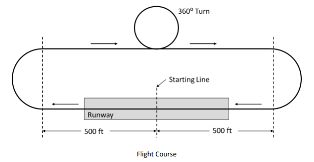

# Project 1 - Design/Build/Fly Aircraft Design Optimization

## Problem Outline:
Design/Build/Fly (DBF) is an annual collegiate aircraft design competition hosted by the AIAA (American Institute of Aeronautics and Astronautics), that several of our team members are participating in as part of an ASU Student Organization. The rules for this year's competition are linked [here](https://aiaa.org/wp-content/uploads/2026/09/DBF-2027-Rules-Draft.pdf). The purpose of this event is to put teams through a full design cycle from initial requirements to a fully-built and mission capable system in the span of an academic year. A significant part of the design cycle is optimization to maximize scoring potential, and thus placement in the competition. Aside from the competition itself, there are many implications for the use of design optimization within the UAV (Unmanned Aerial Vehicle) domain that share similar processes and applications with DBF. 

The objective for this year's competition is to design a remotely piloted UAV to carry a 'sensor' payload for transportation and deployment. In our simplification of the ruleset, there are three scoring missions:

**Ground Mission**:  Drop the sensor within a protective shipping container from 5 feet off the ground and sustain no damage. This is done in a stationary position on the ground. 
    GM score is the sensor weight in lbs, normalized to a maximum weight of 10 lbs

**Mission 2**: Carry the shipping container with sensor inside and fly 5 laps around the course within 5 minutes.
    M2 score is the sensor weight in lbs, divided by the time to complete the 5 laps in seconds. Normalized to 0.15 lb/s

**Mission 3**: Deploy the sensor (M3 sensor weight can be less than M2 and GM) in flight and fly as many laps as possible in 5 minutes.
    M3 score is the M3 sensor weight in lbs times the number of laps completed in 5 minutes. Normalized to 50 lb*laps

### Course:
The aircraft will take off from the 'Starting Line', and each lap is counted once the starting line is passed. Landing is not a part of the lap. The course is an oval shape with a 360 degree turn on the straight opposite of the starting position. 

---

### Decision Variables:
The optimization varies the following design variables to maximize the total competition score.

| Variable   | Definition                                     | Bounds                     | Type       |
| ---------- | ---------------------------------------------- | -------------------------- | ---------- |
| $S_w$      | Wing area                                      | $2 \le S_w \le 10$ ft²     | Continuous |
| $L_F$      | Fuselage length                                | $5 \le L_F \le 7$ ft       | Continuous |
| $SW_{1,2}$ | Sensor weight for Ground Mission and Mission 2 | $4 \le SW_{1,2} \le 12$ lb | Continuous |
| $SW_3$     | Sensor weight for Mission 3                    | $0 \le SW_3 \le 6$ lb      | Continuous |
| $V_2$      | Cruise velocity during Mission 2               | $40 \le V_2 \le 140$ ft/s  | Continuous |
| $V_3$      | Cruise velocity during Mission 3               | $40 \le V_3 \le 140$ ft/s  | Continuous |

All other aircraft parameters, such as the sizing of the vertical/horizontal tail surfaces and the fuselage diameter, will be driven by these optimization variables.

### Objective Function:
$Score = \frac{SW_{1,2}}{10} + \frac{SW_{1,2}/Time}{0.15} + \frac{SW_{3}*Laps_3}{50}$

In the objective function, Time and Laps are outputs of the lap simulator, which are functions of the decision variables. 
Success in the competition is purely determined by maximizing the total score, which is a sum of all three mission scores.

### Constraints:
The following constraints define the feasible design space for the optimization and are summarized in the table below. They include both competition rules and additional design constraints adopted by the team to ensure manufacturability and computational efficiency.
#### Rule-Imposed Limitations
- Wing span, $b \le 6 ft$
- Aircraft Weight, $W_T \le 55 lbs$
- Propulsion battery energy $\le 100Wh$

#### Operational Limitations and Early Design Decisions 
These are design decisions based on engineering intuition and historically successful DBF teams. This is intended to reduce the computational load of the model, and enforce several non-optimization related parameters such as manufacturability and available hardware.   
- Aircraft Weight, $W_T \le 20 lbs$
- Aircraft Empty Weight, $W_e \ge 10 lbs$
- Wing span, $b = 6 ft$

| Constraint | Mathematical Expression | Description |
|------------|-------------------------|-------------|
| Wing span | $b = 6$ ft | Wing span is fixed to the maximum allowable span to maximize lifting surface while satisfying competition rules. |
| Total aircraft weight | $W_T \le 20$ lb | Limits total aircraft weight based on the team's manufacturing target. |
| Empty aircraft weight | $W_e \ge 10$ lb | Prevents unrealistic structural designs with insufficient empty weight. |
| Battery energy | $E_b \le 100$ Wh | Satisfies the competition battery energy limit. |
| Mission 3 payload | $0 \le SW_3 \le SW_{1,2}$ | Mission 3 payload cannot exceed the payload carried during the Ground Mission and Mission 2. |
| Mission 2 Time | $t_2 \le 300s$ | Enforces maximum mission time of 5 minutes (300 seconds) |

#### Lap Simulator Simplifications
These are simplifications to estimate preliminary design and increase fidelity in certain parts of the simulation. All of these simplifications are fixed throughout the optimization to reduce model complexity.
- Propulsion will be modelled after a known/tested motor and propeller combination.
- Aircraft configuration will be fixed-wing, with a single wing and inverted T-Tail
- Fuselage will have a circular cross-section
- Sensor will be a 6:1 length:diameter cylinder filled with leadshot with a nosecone for reduced drag
- Turns will be done at 2.5g
- Static margin at 10%

| Simplification             | Description                                                                                          |
| ---------------------- | ---------------------------------------------------------------------------------------------------- |
| Propulsion model       | Aircraft performance is modeled using a known and experimentally tested motor/propeller combination. |
| Aircraft configuration | Fixed-wing aircraft with a single wing and inverted T-tail configuration.                            |
| Fuselage geometry      | Circular fuselage cross-section is assumed.                                                          |
| Sensor geometry        | Payload is modeled as a 6:1 length-to-diameter cylinder with a nosecone.                             |
| Turn model             | All turns are performed at a constant load factor of 2.5 g.                                          |
| Static stability       | Static margin is fixed at 10%.                                                                       |

  

### Problem Classification
This problem is formulated as a constrained nonlinear programming (NLP) problem. The objective function depends on the results of a lap simulator that predicts aircraft performance based on the selected design variables. The simulator incorporates nonlinear aerodynamic, propulsion, and flight dynamics models, causing the objective function to vary nonlinearly with the design variables. Additionally, the optimization problem is nonconvex because the aerodynamic performance, mission completion time, and aircraft stability characteristics may produce multiple local optima within the feasible design space. As a result, there is no guarantee that a locally optimal solution is also the global optimum. Therefore, the Design/Build/Fly aircraft optimization problem is classified as a constrained, nonconvex nonlinear optimization problem.

### Solution Methodology
The design optimization is based on the results of a lap simulator intended to model the performance of the vehicle under certain parameters. The optimization itself varies the decision variables and imposes constraints, finally using the objective function to evaluate a configuration. Configurations that do not meet the constraints are thrown out. The configuration with the highest score gives the payload sizing/weight, cruise speed, and airframe sizing, as well as the number of laps needed to achieve such score.  

### Results and Interpretation

### Code and Reproducibility
