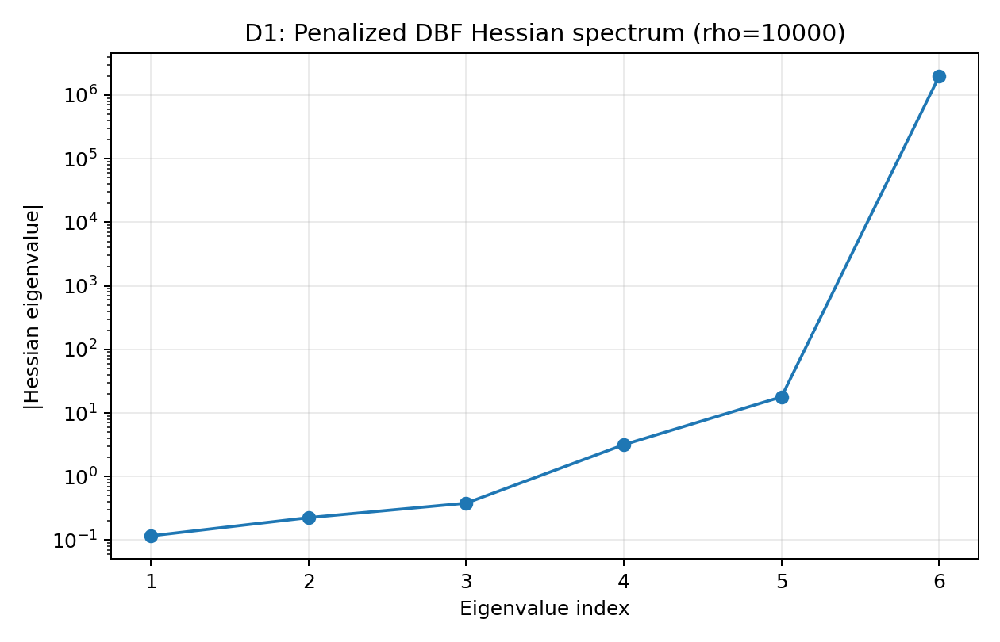
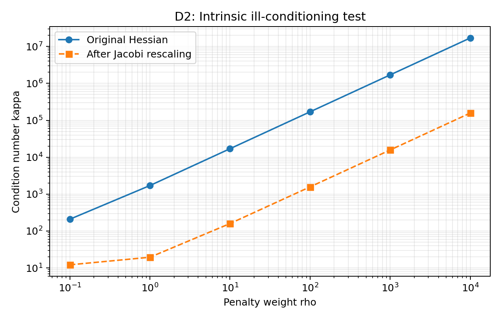
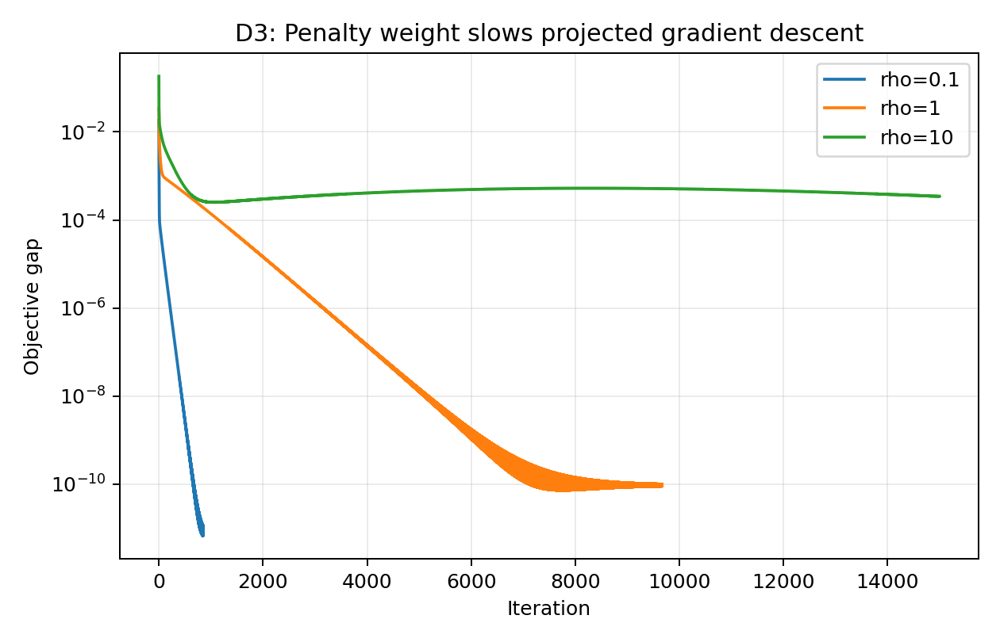
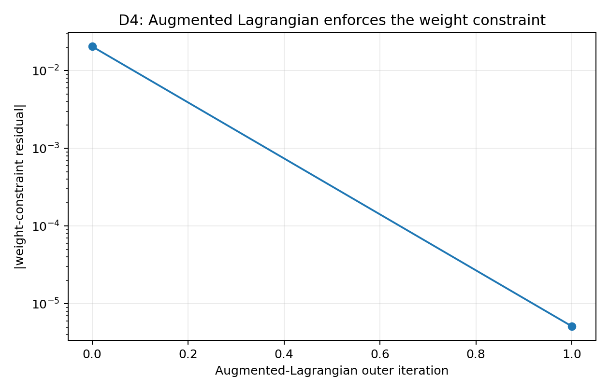

# Project 2 - Ill-Conditioned Optimization of a Design/Build/Fly Aircraft

## 1. Problem Identification and Motivation

Design/Build/Fly (DBF) is an annual collegiate aircraft design competition hosted by the AIAA (American Institute of Aeronautics and Astronautics). Teams design, build, and fly a remotely piloted aircraft that must satisfy a mission-specific ruleset while balancing payload capability, aerodynamic performance, structural design, propulsion requirements, and mission completion time.

This project reuses the aircraft sizing and mission-performance model developed in Project 1. In Project 1, the design objective was to maximize a normalized competition score by varying aircraft geometry, payload weight, and mission cruise speeds. Project 2 studies the same design problem from a numerical optimization perspective by reformulating an aircraft-weight constraint with a quadratic penalty.

Aircraft design teams routinely optimize performance while enforcing structural and operational requirements. If those requirements are imposed using a poorly conditioned numerical formulation, an optimizer may require many more iterations or may fail to converge to a useful tolerance. This matters in DBF and in broader UAV preliminary design because design optimization is most useful when constraints can be enforced accurately without making the numerical problem unnecessarily difficult to solve.

The purpose of this project is therefore to demonstrate **intrinsic ill-conditioning** in a physically motivated aircraft optimization problem, quantify its effect on a baseline first-order optimizer, and demonstrate a more effective constraint-handling method.

The three scoring missions remain based on the Project 1 model:

- **Ground Mission:** The aircraft carries a sensor payload. The score contribution is proportional to sensor weight.
- **Mission 2:** The aircraft carries the sensor in its shipping container and completes five laps. The score rewards higher payload weight and shorter completion time.
- **Mission 3:** The sensor is deployed and the aircraft flies as many laps as possible within five minutes. The score is proportional to deployed sensor weight multiplied by the number of completed laps.

---

## 2. Formulation

### 2.1 Decision Variables

The optimization uses six continuous design variables:

$$
\mathbf{x} =
\left[
S_w,\;
L_F,\;
SW_2,\;
SW_3,\;
V_2,\;
V_3
\right]^T
\in \mathbb{R}^6
$$

| Variable | Definition | Project 2 bounds | Type |
|---|---|---:|---|
| $S_w$ | Wing area | $2 \le S_w \le 10\ \mathrm{ft}^2$ | Continuous |
| $L_F$ | Fuselage length | $5 \le L_F \le 7\ \mathrm{ft}$ | Continuous |
| $SW_2$ | Sensor weight for Ground Mission and Mission 2 | $4 \le SW_2 \le 16\ \mathrm{lb}$ | Continuous |
| $SW_3$ | Sensor-weight reduction for Mission 3 | $0 \le SW_3 \le 6\ \mathrm{lb}$ | Continuous |
| $V_2$ | Mission 2 cruise velocity | $40 \le V_2 \le 140\ \mathrm{ft/s}$ | Continuous |
| $V_3$ | Mission 3 cruise velocity | $40 \le V_3 \le 140\ \mathrm{ft/s}$ | Continuous |

The Project 1 upper bound on $SW_2$ was 12 lb. For this conditioning study, the upper bound is intentionally increased to 16 lb. This allows the 20 lb Mission 2 gross-weight constraint to become active before the payload box bound becomes active. This is a Project 2 study modification and is not intended to represent a change to the original competition rules.

All other aircraft geometry is derived from these variables. Wing span remains fixed at 6 ft, the sensor is modeled as a 6:1 cylindrical payload, and the fuselage and empennage dimensions are determined from the selected design variables.

### 2.2 Original Constrained Problem

The base objective is the negative normalized DBF competition score because the numerical optimizer minimizes its objective:

$$
f(\mathbf{x}) =
-\left[
\frac{SW_2}{12}
+
\frac{SW_2}{0.15\,t_2}
+
\frac{(SW_2-SW_3)\,\widetilde{L}_3}{50}
\right]
$$

where:

- $t_2$ is the time required to complete five Mission 2 laps,
- $\widetilde{L}_3$ is the continuous Mission 3 lap estimate used for the conditioning study,
- $\mathbf{x}$ is the six-dimensional design vector defined above.

The physical weight constraint used in this project is

$$
g(\mathbf{x}) =
W_{M2}(\mathbf{x}) - 20
\le 0
$$

with

$$
W_{\mathrm{M2}} =
W_e + 1.1\,SW_2
$$

Here, $W_e$ is the modeled empty-aircraft weight. The factor 1.1 accounts for the modeled Mission 2 shipping-container weight used in Project 1.

The original constrained problem can therefore be written as

$$
\begin{aligned}
\min_{\mathbf{x}}\quad & f(\mathbf{x}) \\
\text{subject to}\quad & g(\mathbf{x}) \le 0, \\
& \mathbf{x}_{\min} \le \mathbf{x} \le \mathbf{x}_{\max}.
\end{aligned}
$$

### 2.3 Quadratic Penalty Reformulation

For the Project 2 conditioning study, the Mission 2 weight constraint is moved into the objective with a quadratic exterior penalty:

$$
F_{\rho}(\mathbf{x}) =
f(\mathbf{x})
+
\frac{\rho}{2}
\left[
\max\left(0,\,g(\mathbf{x})\right)
\right]^2
$$

The scalar $\rho>0$ is the penalty weight. A larger value of $\rho$ penalizes constraint violation more strongly, forcing the solution closer to the boundary $g(\mathbf{x})=0$. The same parameter also becomes the structural knob used to demonstrate ill-conditioning.

### 2.4 Constraints and Bounds

| Constraint or bound | Mathematical expression | Description |
|---|---|---|
| Mission 2 gross weight | $W_e+1.1SW_2 \le 20\ \mathrm{lb}$ | Team design target for aircraft and payload weight |
| Wing area | $2 \le S_w \le 10\ \mathrm{ft}^2$ | Limits lifting-surface size |
| Fuselage length | $5 \le L_F \le 7\ \mathrm{ft}$ | Limits aircraft length |
| Mission 2 payload | $4 \le SW_2 \le 16\ \mathrm{lb}$ | Project 2 study range |
| Mission 3 payload reduction | $0 \le SW_3 \le 6\ \mathrm{lb}$ | Limits payload reduction between missions |
| Mission 2 speed | $40 \le V_2 \le 140\ \mathrm{ft/s}$ | Cruise-speed range |
| Mission 3 speed | $40 \le V_3 \le 140\ \mathrm{ft/s}$ | Cruise-speed range |

### 2.5 Aircraft Model and Numerical Smoothing

The Project 2 model preserves the main engineering relationships from Project 1, including:

- sensor sizing from payload weight and lead-shot density,
- wing geometry based on a fixed 6 ft span,
- empirical fuselage, wing, electronics, and empennage weight estimates,
- induced and parasite drag,
- propulsion current as a function of required thrust and velocity,
- straight and turning flight times,
- battery-energy limitation,
- normalized DBF mission scoring.

Several numerical changes are required because Project 2 uses gradients, Hessians, and eigenvalue analysis. The original Project 1 simulator contained discrete switching operations that are appropriate for competition scoring but do not produce a smooth objective for local conditioning analysis.

The Project 2 model therefore makes the following changes:

1. Mission 3 lap count is treated continuously instead of applying `floor()`.
2. Throttle is solved continuously rather than selected from a 100-point throttle array.
3. Turn load factor is handled with a continuous $C_{L,\max}$-limited relation rather than repeated discrete decrements.
4. Smooth limiting expressions are used where the original model switched abruptly between limiting cases.

These changes preserve the same underlying aircraft-design relationships while allowing meaningful finite-difference gradients and Hessians to be computed.

### 2.6 Problem Classification

The Project 2 aircraft formulation is a **constrained, nonlinear, nonconvex optimization problem** studied through a smooth penalty reformulation.

The base objective is nonlinear because geometry, aerodynamic drag, propulsion demand, mission time, battery use, and competition score depend nonlinearly on the decision variables. The coupled aircraft-performance relationships can also produce multiple local optima, so the problem is nonconvex.

For the conditioning study, the Mission 2 inequality constraint is moved into the objective using a quadratic exterior penalty. This places the numerical mechanism in **Family G: penalty/barrier reformulations**.

---

## 3. Ill-Conditioning Mechanism

### 3.1 Family G Penalty Mechanism

When the weight constraint is active, the penalty contribution can be written locally as

$$
P(\mathbf{x})
=
\frac{\rho}{2}g(\mathbf{x})^2.
$$

Its Hessian is

$$
\nabla^2P
=
\rho\,\nabla g\,\nabla g^T
+
\rho\,g\,\nabla^2g.
$$

Near the active constraint boundary, $g(\mathbf{x})\approx0$, so the second term becomes small and the dominant penalty curvature is approximately

$$
\nabla^2P
\approx
\rho\,\nabla g\,\nabla g^T.
$$

This term creates a stiff direction normal to the weight-constraint surface. Directions tangent to the constraint remain governed primarily by the original aircraft objective and therefore retain much smaller curvature.

The local Hessian condition number is

$$
\kappa(H)
=
\frac{\lambda_{\max}(H)}{\lambda_{\min}(H)},
$$

where $\lambda_{\max}$ and $\lambda_{\min}$ are the largest and smallest positive eigenvalues used in the local conditioning analysis. As $\rho$ increases, the penalty-dominated eigenvalue increases approximately in proportion to $\rho$, while the smaller-curvature directions change much less. The result is an increasingly elongated optimization landscape and a rapidly increasing condition number.

### 3.2 D1 - Hessian Eigenvalue Spectrum

The Hessian was evaluated numerically in normalized design coordinates near the optimum of the penalized problem. For the largest tested penalty weight, $\rho=10{,}000$, the smallest positive eigenvalue is approximately

$$
\lambda_{\min}=0.1166,
$$

and the largest is approximately

$$
\lambda_{\max}=1.98\times10^6.
$$

Therefore,

$$
\kappa(H)
\approx
1.70\times10^7.
$$

The spectrum spans many orders of magnitude, demonstrating a strongly elongated local optimization landscape.



### 3.3 D2 - Intrinsic Ill-Conditioning Test

The required intrinsic-conditioning test has two parts:

1. The condition number must grow with a structural knob.
2. The large condition number must survive best per-coordinate Jacobi rescaling.

For this problem, the structural knob is the penalty weight $\rho$. The penalty weight was varied from $0.1$ to $10{,}000$. At each value, the penalized problem was optimized and the local Hessian was evaluated.

| Penalty weight $\rho$ | Weight residual $g$ (lb) | $\kappa(H)$ | $\kappa$ after Jacobi rescaling |
|---:|---:|---:|---:|
| 0.1 | 1.03646 | $2.09\times10^2$ | $1.22\times10^1$ |
| 1 | 0.10278 | $1.71\times10^3$ | $1.95\times10^1$ |
| 10 | 0.01027 | $1.70\times10^4$ | $1.60\times10^2$ |
| 100 | 0.00103 | $1.70\times10^5$ | $1.57\times10^3$ |
| 1,000 | 0.000103 | $1.70\times10^6$ | $1.57\times10^4$ |
| 10,000 | 0.0000102 | $1.70\times10^7$ | $1.57\times10^5$ |

The first requirement is satisfied because $\kappa(H)$ increases by approximately one order of magnitude each time $\rho$ increases by one order of magnitude. Over the tested range,

$$
\kappa(H)\propto\rho
$$

is a good approximation.

For the second requirement, let

$$
D=\operatorname{diag}(H)
$$

and apply symmetric Jacobi rescaling:

$$
H_J
=
D^{-1/2}HD^{-1/2}.
$$

At $\rho=10{,}000$, the rescaled condition number is still approximately

$$
\kappa(H_J)
\approx
1.57\times10^5.
$$

Diagonal scaling reduces the numerical value of the condition number but does not remove its growth with $\rho$. Therefore, the problem passes both parts of the required intrinsic-$\kappa$ test: the ill-conditioning grows with a structural parameter and survives per-coordinate rescaling.



---

## 4. Effect of Ill-Conditioning

### 4.1 D3 - Baseline Projected Gradient Descent

To demonstrate the practical effect of the increasing condition number, projected gradient descent was applied to the penalized objective. Before this experiment, each decision variable was normalized to the interval $[0,1]$ so that the measured slowdown would not be dominated by differences in engineering units.

The local fixed step size was chosen from the positive Hessian eigenvalues using

$$
\alpha
=
\frac{2}{L+\mu},
$$

where

$$
L=\lambda_{\max}(H)
\qquad\text{and}\qquad
\mu=\lambda_{\min}(H).
$$

Convergence was declared when the projected-gradient norm satisfied

$$
\left\|\nabla_PF_{\rho}(\mathbf{x}_k)\right\|_2
\le
10^{-5}.
$$

Each case used a maximum of 15,000 iterations.

| Penalty weight $\rho$ | Iterations | Final projected-gradient norm | Final objective gap |
|---:|---:|---:|---:|
| 0.1 | 849 | $9.97\times10^{-6}$ | $1.14\times10^{-11}$ |
| 1 | 9,668 | $1.00\times10^{-5}$ | $1.00\times10^{-10}$ |
| 10 | 15,000* | $3.49\times10^{-1}$ | $3.43\times10^{-4}$ |

\*The $\rho=10$ case reached the 15,000-iteration limit before satisfying the convergence tolerance.

The increase from 849 iterations at $\rho=0.1$ to 9,668 iterations at $\rho=1$ shows the practical slowdown caused by the increasingly elongated local landscape. At $\rho=10$, the baseline first-order method does not reach the required tolerance within the allowed iteration count.



---

## 5. Proposed Solution and Demonstration

### 5.1 Augmented Lagrangian Method

A fixed quadratic penalty creates a numerical tradeoff. A small penalty weight produces a manageable optimization landscape but allows noticeable constraint violation. A very large penalty weight enforces the constraint accurately but makes the local problem severely ill-conditioned.

The proposed remedy is an **augmented Lagrangian method**. For the inequality constraint $g(\mathbf{x})\le0$, the implemented augmented objective is

$$
\mathcal{L}_A(\mathbf{x},\lambda,\rho)
=
f(\mathbf{x})
+
\frac{\rho}{2}
\left[
\max\left(
0,
g(\mathbf{x})+\frac{\lambda}{\rho}
\right)
\right]^2
-
\frac{\lambda^2}{2\rho}.
$$

After each inner optimization, the multiplier is updated as

$$
\lambda_{k+1}
=
\max\left(
0,
\lambda_k+\rho g(\mathbf{x}_k)
\right).
$$

The multiplier carries information about the active constraint, allowing the method to obtain high constraint accuracy without increasing $\rho$ to the extremely large values required by a pure fixed-penalty method.

### 5.2 D4 - Before/After Constraint Enforcement and Conditioning

The large fixed-penalty case used $\rho=10{,}000$ and produced

$$
g(\mathbf{x})
=
1.02\times10^{-5}\ \mathrm{lb}
$$

with

$$
\kappa(H)
\approx
1.70\times10^7.
$$

The augmented Lagrangian started with $\rho=5$ and reached a feasible solution after two outer iterations. Its final constraint residual was

$$
g(\mathbf{x})
=
-5.11\times10^{-6}\ \mathrm{lb},
$$

while the local condition number was approximately

$$
\kappa(H_{AL})
\approx
8.51\times10^3.
$$

Thus, both methods enforce the gross-weight requirement to approximately the same numerical accuracy, but the augmented-Lagrangian local problem has a condition number roughly three orders of magnitude smaller.

The augmented-Lagrangian outer-iteration history is shown below.



### 5.3 D4 - Before/After Convergence Comparison

A second D4 diagnostic compares the local convergence behavior directly. To isolate the conditioning effect, projected gradient descent was started from an equal-size perturbation in normalized coordinates around each converged solution. Each objective gap was divided by its own initial objective gap so that the convergence rates can be compared even though the two formulations have different objective scales.

After 20,000 projected-gradient iterations:

| Local formulation | Final projected-gradient norm | Final objective gap | Relative objective gap |
|---|---:|---:|---:|
| Fixed penalty, $\rho=10{,}000$ | $1.33\times10^{-1}$ | $2.10\times10^{-3}$ | $9.92\times10^{-6}$ |
| Augmented-Lagrangian local objective | $8.33\times10^{-4}$ | $2.05\times10^{-9}$ | $1.90\times10^{-8}$ |

At the same iteration count, the augmented-Lagrangian local formulation has a projected-gradient norm about 160 times smaller and a relative objective gap more than 500 times smaller than the large fixed-penalty formulation. This provides a direct before/after convergence demonstration in addition to the condition-number comparison.


The final augmented-Lagrangian design is approximately:

| Variable | Final value |
|---|---:|
| Wing area, $S_w$ | $5.96\ \mathrm{ft}^2$ |
| Fuselage length, $L_F$ | $5.06\ \mathrm{ft}$ |
| Mission 2 sensor weight, $SW_2$ | $12.50\ \mathrm{lb}$ |
| Mission 3 sensor reduction, $SW_3$ | $0.87\ \mathrm{lb}$ |
| Mission 2 cruise velocity, $V_2$ | $140.0\ \mathrm{ft/s}$ |
| Mission 3 cruise velocity, $V_3$ | $85.48\ \mathrm{ft/s}$ |
| Empty-aircraft weight | $6.25\ \mathrm{lb}$ |
| Mission 2 gross weight | $20.00\ \mathrm{lb}$ |
| Mission 2 five-lap time | $123.46\ \mathrm{s}$ |
| Continuous Mission 3 lap estimate | $7.21$ laps |

The final unpenalized objective is approximately

$$
f(\mathbf{x})
=
-3.39336.
$$

### 5.4 Results and Interpretation

The penalty study demonstrates the expected Family G mechanism. Increasing the quadratic penalty weight reduces the weight-constraint violation, but the penalty also introduces a very stiff curvature direction normal to the constraint surface. The remaining directions retain substantially smaller curvature from the underlying aircraft-performance objective. This produces approximately linear growth of the condition number with $\rho$.

The Jacobi-rescaling test shows that the effect is not only a consequence of the variables having different units. Although diagonal rescaling improves the numerical condition number, the scaled problem still becomes increasingly ill-conditioned as $\rho$ grows.

The conditioning change has a direct effect on a baseline first-order optimizer. Projected gradient descent requires substantially more iterations as the penalty weight grows and does not reach the target tolerance for the $\rho=10$ test within 15,000 iterations.

The augmented-Lagrangian method addresses the mechanism directly. Instead of relying on an extremely large fixed penalty, it uses a moderate penalty together with a multiplier update. It reaches essentially the same constraint accuracy as the $\rho=10{,}000$ penalty case while keeping the local condition number far smaller and producing substantially faster local first-order convergence.

For this DBF design problem, the result demonstrates that directly forcing engineering constraints with increasingly large penalty coefficients can make an otherwise manageable optimization problem unnecessarily difficult to solve. A constraint-handling approach such as an augmented Lagrangian can enforce the same engineering requirement while maintaining a better-conditioned numerical problem.

---

## 6. Assumptions and Simplifications

The results depend on the aircraft model and several simplifying assumptions:

- The model is a preliminary-design approximation and is not a full CFD or flight-dynamics simulation.
- Wing span is fixed at 6 ft.
- The aircraft uses a single-wing fixed-wing configuration with an inverted T-tail.
- The sensor is represented as a 6:1 lead-shot-filled cylindrical payload with a nosecone.
- Structural weight is estimated using empirical relationships inherited from Project 1.
- Propulsion behavior is based on the Project 1 motor/propeller model.
- Mission 3 lap count is treated continuously for the conditioning analysis rather than rounded to an integer.
- Battery and time limiting behavior are smoothed where required for differentiability.
- Numerical gradients and Hessians are computed using finite differences, so their accuracy depends on the selected perturbation size.
- Hessian conditioning is evaluated in normalized design coordinates to reduce contamination from engineering-unit scale differences.
- The 16 lb Project 2 payload upper bound is used only to expose the 20 lb Mission 2 gross-weight constraint as the active limiting mechanism.
- The augmented-Lagrangian and fixed-penalty comparisons describe local numerical behavior of this model and do not prove that the reported aircraft is the global optimum of the complete competition-design problem.

---

## 7. Code and Reproducibility

Two Python scripts are used for the Project 2 study:

- [`Project2Models.py`](Project2Models.py) contains the smooth DBF aircraft model, mission-performance calculations, base competition objective, gross-weight constraint, quadratic penalty objective, and augmented-Lagrangian objective.
- [`Project2Diagnostics.py`](Project2Diagnostics.py) runs the numerical experiments, computes finite-difference gradients and Hessians, evaluates Hessian spectra and condition numbers, performs Jacobi rescaling, runs projected gradient descent, and evaluates the augmented-Lagrangian remedy.

### 7.1 Software Requirements

The analysis uses Python 3 and the following third-party packages:

- NumPy
- SciPy
- Matplotlib

The remaining imports are from the Python standard library.

A typical installation command is:

```bash
python -m pip install numpy scipy matplotlib
```

### 7.2 Running the Analysis

Place the following files in the repository root:

```text
Project2DBFIllConditioning_updated.md
Project2Models.py
Project2Diagnostics.py
project2_outputs/
```

From the repository root, run:

```bash
python Project2Diagnostics.py
```

The script recreates the numerical tables and figures in `project2_outputs/`.

The main generated files are:

```text
project2_outputs/D1_hessian_spectrum.png
project2_outputs/D2_kappa_vs_rho.png
project2_outputs/D3_gradient_descent_convergence.png
project2_outputs/D4_augmented_lagrangian_constraint.png
project2_outputs/D4_before_after_convergence.png
project2_outputs/conditioning_vs_rho.csv
project2_outputs/gradient_descent_summary.csv
project2_outputs/augmented_lagrangian_history.csv
project2_outputs/d4_before_after_summary.csv
```

### 7.3 Reproducibility Notes

No random sampling or randomized optimizer is used in the current analysis, so a random seed is not required. The starting designs, penalty weights, finite-difference step sizes, optimizer tolerances, and iteration limits are explicitly defined in the scripts. Running the diagnostic script with the same code and package versions should therefore reproduce the reported numerical results to normal floating-point tolerance.

As a small verification step, the reported condition-number trend, constraint residuals, and convergence counts should be checked against the generated CSV files after each run before the figures are committed to the repository.
